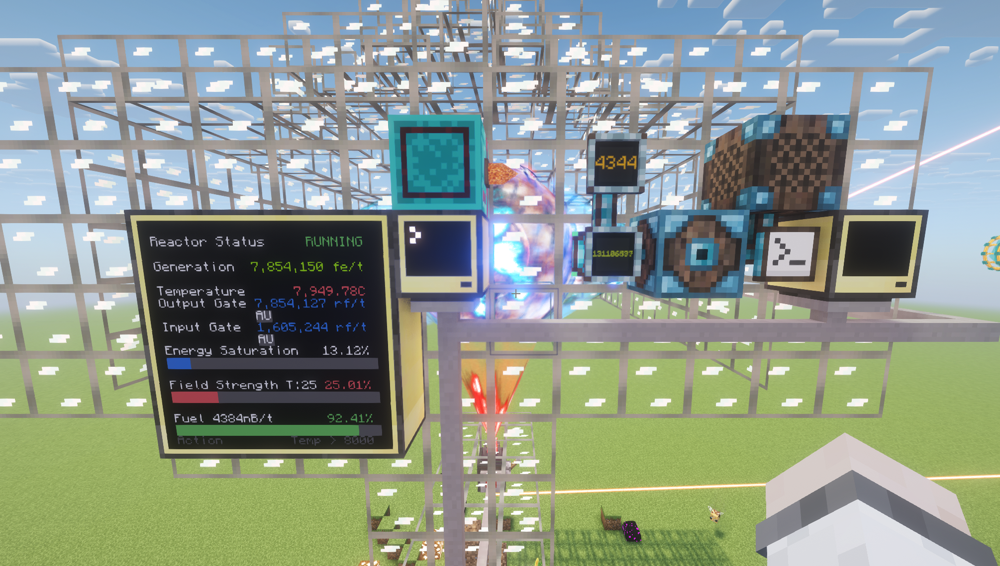

> *status*: currently stable, and documented


# drmon
Monitor and failsafe automation for your draconic reactor

### What is this
This is a computercraft LUA script that monitors everything about a draconic reactor, with a couple features to help keep it from exploding.
NB: This is for Minecraft 1.21.1. You will need to edit references within the code for any version higher to reflect any changes made to Draconic Evolution past its 1.21.1 release.


### Tutorial
You can find many very well made youtube tutorials on how to set this up
* [1](https://www.youtube.com/watch?v=jBgXRTL9EkE), by [Brandon3055](https://www.youtube.com/@Brandon3055)
* [2](https://www.youtube.com/watch?v=r9pRXcwtEGk), by [zzApotheosis](https://www.youtube.com/@zzApotheosis)
* [3](https://www.youtube.com/watch?v=pmRWGzYRbHE), by [zzApotheosis](https://www.youtube.com/@zzApotheosis)
* [4](https://www.youtube.com/watch?v=nOoDNpVh2ww), by [To Asgaard](https://www.youtube.com/@ToAsgaard)
* [5](https://www.youtube.com/watch?v=8rBhQP1xqEU), by [The MindCrafters](https://www.youtube.com/channel/UCf2wEy4_BbYpAQcgvN26OaQ)
* [6](https://www.youtube.com/watch?v=-BM9F3Bz-9w), by [direwolf20](https://www.youtube.com/@direwolf20)
* [7](https://www.youtube.com/watch?v=RSQ-GDJgAKk), by [Lashmak](https://www.youtube.com/@Lashmak)
* [8](https://www.youtube.com/watch?v=poKzJBhZoVM), by [JaviHerobrine](https://www.youtube.com/@JaviHerobrine)
* [9](https://www.youtube.com/watch?v=b6_PgtkiTXI), by [direwolf20](https://www.youtube.com/@direwolf20)
* [10](https://www.youtube.com/watch?v=zrIOkNlaLiQ), by [ShaneyFangzz](https://www.youtube.com/@ShaneyFangzz)


### Features
* Uses a 3x3 advanced computer touchscreen monitor to interact with your reactor
* Accurately maintains desired temperature to within +/- 0.01 degrees
* Automated regulation of the input gate for the targeted field strength of 25%
  * Adjustable
* Automated regulation of the output gate for the targeted core saturation of 10%
  * Adjustable 
* Immediate shutdown and charge reactor when field strength depleted below 10% or core saturation depleted below 5%
  * Adjustable
  * Reactor will auto activate upon a successful charge
* Immediate shutdown when your temperature goes above 8000C
  * Adjustable
  * Reactor will reactivate upon temperature cooling down to at/below 3500C
    * Adjustable
* Easily tweak your output flux gate via touchscreen buttons
  * +/-100k, 10k, and 1k increments

### Requirements
* One fully setup draconic reactor with fuel
* 1 advanced computer
* 9 advanced monitors
* 3 wired modems, wireless will not work
* A bunch of network cable

### Installation
* Place stabilizers pointing in towards the core on the 4 ordinals. They must all be the same plane: XZ, XY, or YZ.
  * They need to be at least 6 blocks away from the core.
* Place injector pointing in towards the core on one of the remaining ordinal.
* Attach a flux gate to the injector with the red arrow pointing in.
* Attach at least one flux gate to the stabilizers with the red arrow pointing out.
* Attach an advanced computer to the back of a free stabilizer without a flux gate. To one of the computer's side, either left or right, attach the 9 advanced monitor.
  * Optional: It is not necessary for the monitors to be directly attached to the computer. You can attach a wired modem to the monitor then connect it to the computer via network cable. If you do so, make sure to modify the variable for the monitor in the `startup` file.
  * Optional: You can attach a redstone triggered device to the top of the computer that can wrap-up the reactor in the event of a metldown. An example of this is the Advanced Clicker from Just Dire Things filled with cardboard boxes from Mekanism.
* Attach wired modems to the bottom of the computer and flux gates.
* After wiring them up with network cable, right click on each wired modem to add them to the network.
* Take note of the `flow_gate_#` associated with the flux gate on the injector (input) and stabilizer (output). 
* Install this code via running the install script using these commands:

```
> wget https://raw.githubusercontent.com/Fatmice/drmon/refs/heads/master/install.lua install
> install
```
* Modify `startup` to alter any variables at the top of the file, especially the ones holding the `flow_gate_#` for input and output.
```
> startup
```
* You should see stats in your term, and on your monitor once the reactor is valid and has fuel in it.

### Upgrading to the latest version
* Right click your computer
* Hold Ctrl+t until you get a `>`

```
> install
> startup
```

### Known issues
* For Minecraft 1.21.1, if you use shaders, then the reactor core will not show up once you place it down. You will probably will need a [shader fix](https://www.curseforge.com/minecraft/mc-mods/draconic-evolution-render-patcher)
